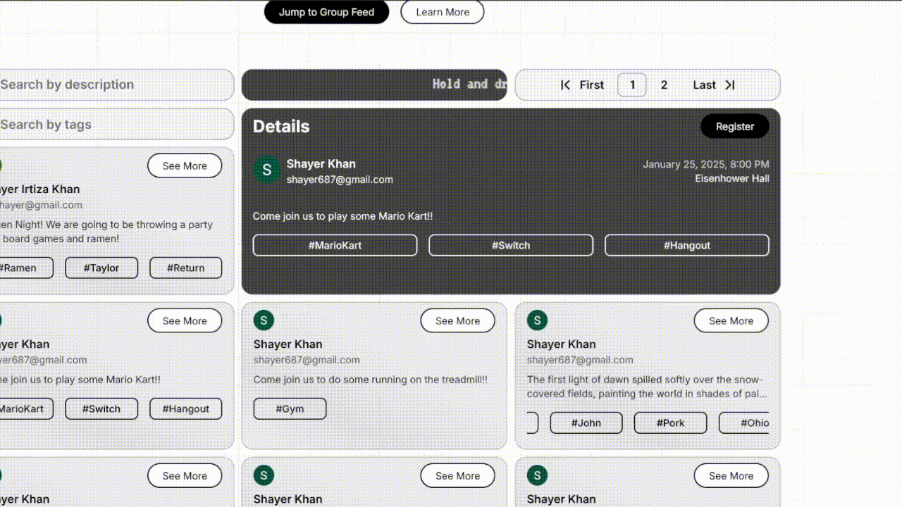
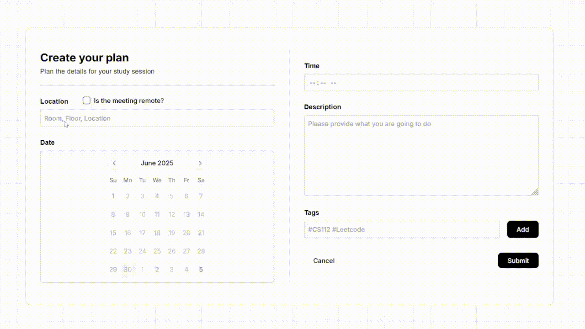

Studious
=======


Studious is a platform that makes it easier for students, or really anyone, to share and discover upcoming study sessions, hangouts, or any kind of event. Users can post events, browse what others are planning, and connect around shared interests or goals.

# Features

- Public Browsing: Anyone can view public posts without needing to sign in.
- Authentication-Only Features: Creating posts, registering for events, and configuring user profiles are limited to authenticated users.
- Google Sign-In: Fast and secure login using Google accounts. Once signed in, users can personalize their profile, host events, or register for others' events, which are then listed under their profile.
- Pagination: Clean and organized browsing with paginated event feeds for better performance and usability.
- Smart Search: Built-in search functionality allows users to quickly filter and find events that match their interests.
- Mobile-First Design: Fully responsive interface optimized for smaller screens and mobile devices.
- Modern Tech Stack: Powered by a serverless backend built with Next.js and MongoDB for seamless performance and scalability.

# Demo






## Installation

Step-by-step guide on how to get the project running locally.

```bash
git clone https://github.com/ikshayer/Studious.git
cd Studious
npm install
npm run dev
